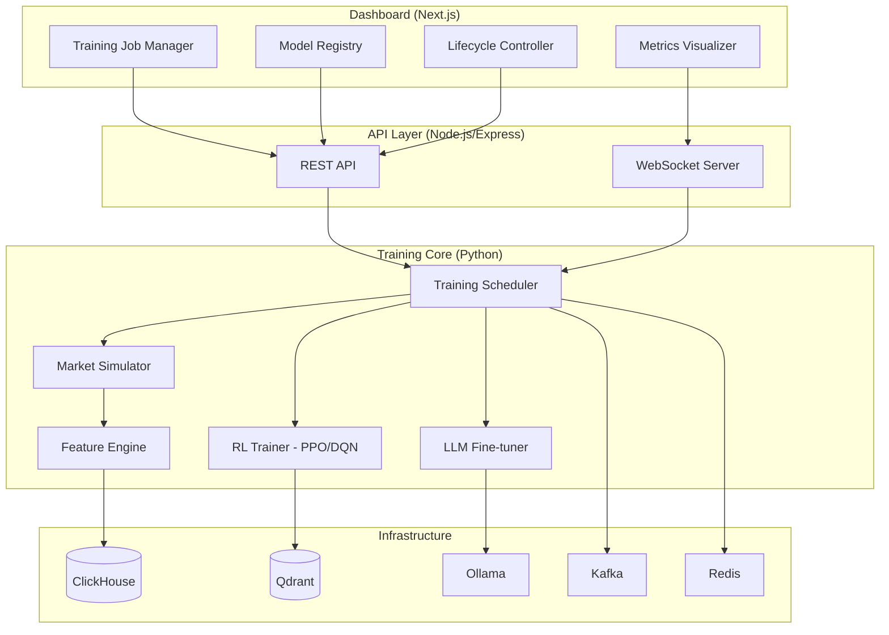

# AI Training Management Dashboard — Implementation Plan

## Overview

Build a **Training Management Dashboard** that controls the full lifecycle of AI model training/fine-tuning for a self-learning crypto trading agent. The platform integrates **Ollama** (LLM inference/fine-tuning), **Qdrant** (experience memory), **ClickHouse** (market data), and provides a rich UI to manage, monitor, and control training jobs.

> [!IMPORTANT]
> This is a **greenfield** project — the workspace only contains [idea.md](file:///home/nhhien/workspaces-ai/re-act-ai/idea.md) with the vision document. We start from scratch.

---

## Proposed Architecture



---

## Day-by-Day, Hour-by-Hour Breakdown

> Each **day = 8 working hours** (9:00 → 17:00). Total: **20 working days**.

---

# 📦 PHASE 1: Foundation & Infrastructure (Day 1–3)

---

## Day 1 — Project Setup & Monorepo Structure

### 9:00–10:00 | Initialize Monorepo

#### [NEW] [package.json](file:///home/nhhien/workspaces-ai/re-act-ai/package.json)
- Root `package.json` with npm workspaces config
- Workspace folders: `packages/api`, `packages/ui`, `packages/training`, `packages/shared`

#### [NEW] [tsconfig.json](file:///home/nhhien/workspaces-ai/re-act-ai/tsconfig.json)
- Root TypeScript config with path aliases

```bash
# Commands
npm init -y
mkdir -p packages/{api,ui,training,shared}
```

### 10:00–12:00 | Infrastructure Docker Compose

#### [NEW] [docker-compose.yml](file:///home/nhhien/workspaces-ai/re-act-ai/docker-compose.yml)
- **Ollama** — LLM inference server (port 11434)
- **Qdrant** — Vector memory store (port 6333/6334)
- **ClickHouse** — Time-series market data (port 8123/9000)
- **Kafka + Zookeeper** — Event streaming (port 9092)
- **Redis** — Cache & pub/sub (port 6379)
- **PostgreSQL** — Training job metadata (port 5432)
- Volumes, networks, health checks for all services

#### [NEW] [infra/init-clickhouse.sql](file:///home/nhhien/workspaces-ai/re-act-ai/infra/init-clickhouse.sql)
- Market data tables: `ohlcv`, `trades`, `orderbook`, `features`

#### [NEW] [infra/init-postgres.sql](file:///home/nhhien/workspaces-ai/re-act-ai/infra/init-postgres.sql)
- Training metadata tables: `training_jobs`, `models`, `model_versions`, `training_metrics`, `training_configs`

### 13:00–15:00 | Shared Types & Interfaces

#### [NEW] [packages/shared/src/types/training.ts](file:///home/nhhien/workspaces-ai/re-act-ai/packages/shared/src/types/training.ts)
- `TrainingJob` interface (id, name, type, status, config, metrics, timestamps)
- `TrainingStatus` enum: `PENDING`, `QUEUED`, `RUNNING`, `PAUSED`, `COMPLETED`, `FAILED`, `CANCELLED`
- `TrainingType` enum: `RL_PPO`, `RL_DQN`, `RL_SAC`, `LLM_FINETUNE`, `GENETIC`, `BACKTEST`
- `TrainingConfig` (epochs, learning_rate, batch_size, model_id, dataset_config)
- `TrainingMetric` (step, loss, reward, win_rate, sharpe_ratio, drawdown, timestamp)

#### [NEW] [packages/shared/src/types/model.ts](file:///home/nhhien/workspaces-ai/re-act-ai/packages/shared/src/types/model.ts)
- `Model` interface (id, name, type, version, status, metrics, created_at)
- `ModelVersion` (version, checkpoint_path, metrics_snapshot, deployed)
- `ModelStatus` enum: `DRAFT`, `TRAINING`, `VALIDATED`, `DEPLOYED`, `ARCHIVED`

#### [NEW] [packages/shared/src/types/market.ts](file:///home/nhhien/workspaces-ai/re-act-ai/packages/shared/src/types/market.ts)
- `OHLCV`, `Trade`, `OrderBook`, `FeatureVector` interfaces
- `MarketState` interface (features + metadata)

### 15:00–17:00 | API Skeleton (Express + TypeScript)

#### [NEW] [packages/api/package.json](file:///home/nhhien/workspaces-ai/re-act-ai/packages/api/package.json)
- Express, TypeScript, ws, pg, cors, dotenv

#### [NEW] [packages/api/src/server.ts](file:///home/nhhien/workspaces-ai/re-act-ai/packages/api/src/server.ts)
- Express server with WebSocket upgrade
- CORS, body parser, health check route

#### [NEW] [packages/api/src/db/index.ts](file:///home/nhhien/workspaces-ai/re-act-ai/packages/api/src/db/index.ts)
- PostgreSQL connection pool (pg)

---

## Day 2 — API Routes & Training Job Backend

### 9:00–12:00 | Training Job CRUD API

#### [NEW] [packages/api/src/routes/training-jobs.ts](file:///home/nhhien/workspaces-ai/re-act-ai/packages/api/src/routes/training-jobs.ts)
- `GET /api/training-jobs` — List all jobs (with pagination, filter by status/type)
- `POST /api/training-jobs` — Create new training job
- `GET /api/training-jobs/:id` — Get job details
- `PUT /api/training-jobs/:id` — Update job config
- `DELETE /api/training-jobs/:id` — Delete job
- `POST /api/training-jobs/:id/start` — Start training
- `POST /api/training-jobs/:id/pause` — Pause training
- `POST /api/training-jobs/:id/resume` — Resume training
- `POST /api/training-jobs/:id/stop` — Stop training

#### [NEW] [packages/api/src/routes/models.ts](file:///home/nhhien/workspaces-ai/re-act-ai/packages/api/src/routes/models.ts)
- `GET /api/models` — List models
- `POST /api/models` — Register new model
- `GET /api/models/:id/versions` — Get model versions
- `POST /api/models/:id/deploy` — Deploy a model version
- `POST /api/models/:id/archive` — Archive model

### 13:00–15:00 | WebSocket for Real-time Metrics

#### [NEW] [packages/api/src/ws/training-stream.ts](file:///home/nhhien/workspaces-ai/re-act-ai/packages/api/src/ws/training-stream.ts)
- WebSocket handler for real-time training metrics streaming
- Subscribes to Redis pub/sub channels for metric updates
- Broadcasts to connected dashboard clients
- Room-based subscription per training job ID

### 15:00–17:00 | Training Metrics API

#### [NEW] [packages/api/src/routes/metrics.ts](file:///home/nhhien/workspaces-ai/re-act-ai/packages/api/src/routes/metrics.ts)
- `GET /api/training-jobs/:id/metrics` — Historical metrics (with time range)
- `GET /api/training-jobs/:id/metrics/latest` — Latest metric snapshot
- `GET /api/training-jobs/:id/logs` — Training logs stream

#### [NEW] [packages/api/src/services/training-service.ts](file:///home/nhhien/workspaces-ai/re-act-ai/packages/api/src/services/training-service.ts)
- Business logic for training job lifecycle management
- State machine transitions: `PENDING → QUEUED → RUNNING → (PAUSED|COMPLETED|FAILED)`
- Validation of state transitions
- Integration with training scheduler (via Redis/Kafka)

---

## Day 3 — Dashboard UI Initialization

### 9:00–12:00 | Next.js Project Setup

```bash
cd packages/ui
npx -y create-next-app@latest ./ --typescript --tailwind --eslint --app --src-dir --no-import-alias
```

#### [MODIFY] [packages/ui/package.json](file:///home/nhhien/workspaces-ai/re-act-ai/packages/ui/package.json)
- Add dependencies: `recharts`, `lucide-react`, `@tanstack/react-query`, `date-fns`, `socket.io-client`

#### [NEW] [packages/ui/src/app/globals.css](file:///home/nhhien/workspaces-ai/re-act-ai/packages/ui/src/app/globals.css)
- Dark mode design system with CSS custom properties
- Premium color palette (deep navy, electric blue, emerald green accents)
- Glassmorphism utility classes
- Smooth gradient definitions
- Animation keyframes (pulse, slide-in, fade, shimmer)

### 13:00–15:00 | Design System & Layout

#### [NEW] [packages/ui/src/components/layout/sidebar.tsx](file:///home/nhhien/workspaces-ai/re-act-ai/packages/ui/src/components/layout/sidebar.tsx)
- Navigation: Dashboard, Training Jobs, Models, Datasets, Settings
- Collapsible with glassmorphism background
- Active route indicator with glow effect

#### [NEW] [packages/ui/src/components/layout/header.tsx](file:///home/nhhien/workspaces-ai/re-act-ai/packages/ui/src/components/layout/header.tsx)
- Breadcrumb, search bar, notification bell, connection status indicator

#### [NEW] [packages/ui/src/app/layout.tsx](file:///home/nhhien/workspaces-ai/re-act-ai/packages/ui/src/app/layout.tsx)
- Root layout with sidebar + main content area

### 15:00–17:00 | Dashboard Overview Page

#### [NEW] [packages/ui/src/app/page.tsx](file:///home/nhhien/workspaces-ai/re-act-ai/packages/ui/src/app/page.tsx)
- Stats cards: Active Jobs, Models Deployed, Total Training Hours, Best Sharpe Ratio
- Running jobs mini-list with progress bars
- Recent activity timeline
- System health indicators (Ollama, Qdrant, ClickHouse status)

---

# 🔧 PHASE 2: Data Pipeline (Day 4–6)

---

## Day 4 — Market Data Collector

### 9:00–12:00 | Python Training Package Setup

#### [NEW] [packages/training/pyproject.toml](file:///home/nhhien/workspaces-ai/re-act-ai/packages/training/pyproject.toml)
- Python package: `ai-training-core`
- Dependencies: `numpy`, `pandas`, `torch`, `gymnasium`, `stable-baselines3`, `clickhouse-connect`, `qdrant-client`, `kafka-python`, `redis`, `websockets`, `ta-lib`

#### [NEW] [packages/training/src/data/collector.py](file:///home/nhhien/workspaces-ai/re-act-ai/packages/training/src/data/collector.py)
- Binance WebSocket connector for real-time OHLCV, trades, orderbook
- Write to Kafka topics: `market.ohlcv`, `market.trades`, `market.orderbook`
- Configurable symbols and timeframes

### 13:00–15:00 | ClickHouse Data Writer

#### [NEW] [packages/training/src/data/storage.py](file:///home/nhhien/workspaces-ai/re-act-ai/packages/training/src/data/storage.py)
- Kafka consumer → ClickHouse batch inserts
- Buffer management, batch write on interval (5s) or count (1000 rows)

#### [NEW] [packages/training/src/data/historical_loader.py](file:///home/nhhien/workspaces-ai/re-act-ai/packages/training/src/data/historical_loader.py)
- Download historical data from Binance REST API
- Backfill ClickHouse with configurable date ranges

### 15:00–17:00 | Dataset Builder

#### [NEW] [packages/training/src/data/dataset_builder.py](file:///home/nhhien/workspaces-ai/re-act-ai/packages/training/src/data/dataset_builder.py)
- Query ClickHouse for time ranges
- Build training episodes from market data
- Save as NumPy arrays or Parquet files

---

## Day 5 — Feature Engineering

### 9:00–12:00 | Technical Indicators

#### [NEW] [packages/training/src/features/indicators.py](file:///home/nhhien/workspaces-ai/re-act-ai/packages/training/src/features/indicators.py)
- RSI, MACD, VWAP, Bollinger Bands, ATR, OBV
- All vectorized with NumPy for speed

#### [NEW] [packages/training/src/features/orderbook_features.py](file:///home/nhhien/workspaces-ai/re-act-ai/packages/training/src/features/orderbook_features.py)
- Orderbook imbalance, bid-ask spread, depth ratio

### 13:00–15:00 | Feature Pipeline

#### [NEW] [packages/training/src/features/feature_pipeline.py](file:///home/nhhien/workspaces-ai/re-act-ai/packages/training/src/features/feature_pipeline.py)
- Composable feature pipeline: `raw data → indicators → normalization → feature vector`
- Feature registry (name, computation function, window size)
- Configurable feature sets per training job

### 15:00–17:00 | Feature Validation & Storage

#### [NEW] [packages/training/src/features/validation.py](file:///home/nhhien/workspaces-ai/re-act-ai/packages/training/src/features/validation.py)
- NaN/Inf checking, range validation
- Feature importance scoring (correlation with returns)
- Store computed features back to ClickHouse `features` table

---

## Day 6 — Datasets API & UI

### 9:00–12:00 | Dataset Management API

#### [NEW] [packages/api/src/routes/datasets.ts](file:///home/nhhien/workspaces-ai/re-act-ai/packages/api/src/routes/datasets.ts)
- `GET /api/datasets` — List available datasets
- `POST /api/datasets` — Create dataset from date range + symbols
- `GET /api/datasets/:id/preview` — Preview data sample
- `GET /api/datasets/:id/stats` — Dataset statistics

### 13:00–17:00 | Dataset Management UI Page

#### [NEW] [packages/ui/src/app/datasets/page.tsx](file:///home/nhhien/workspaces-ai/re-act-ai/packages/ui/src/app/datasets/page.tsx)
- Dataset list with cards showing: symbol, date range, row count, feature count
- "Create Dataset" modal with date picker, symbol selector, feature set picker
- Dataset preview table with sparkline charts

---

# 🧠 PHASE 3: Training Core Engine (Day 7–10)

---

## Day 7 — Market Simulation Environment

### 9:00–12:00 | Gymnasium-compatible Environment

#### [NEW] [packages/training/src/simulation/market_env.py](file:///home/nhhien/workspaces-ai/re-act-ai/packages/training/src/simulation/market_env.py)
- `MarketEnv(gymnasium.Env)` — OpenAI Gym compatible
- Observation space: feature vector (n-dimensional)
- Action space: `Discrete(5)` → BUY, SELL, HOLD, SHORT, CLOSE
- `step()` → advances candle, computes PnL, generates reward
- `reset()` → loads episode from dataset, resets portfolio
- Configurable: timeframe, initial capital, leverage, fees

### 13:00–15:00 | Reward Engineering

#### [NEW] [packages/training/src/simulation/rewards.py](file:///home/nhhien/workspaces-ai/re-act-ai/packages/training/src/simulation/rewards.py)
- `PnLReward` — simple profit/loss
- `SharpeReward` — risk-adjusted returns
- `DrawdownPenaltyReward` — penalize max drawdown
- `CompositeReward` — weighted combination of reward functions

### 15:00–17:00 | Portfolio Tracker

#### [NEW] [packages/training/src/simulation/portfolio.py](file:///home/nhhien/workspaces-ai/re-act-ai/packages/training/src/simulation/portfolio.py)
- Track positions, PnL, equity curve
- Support long/short positions with leverage
- Calculate: total return, max drawdown, Sharpe ratio, win rate

---

## Day 8 — RL Training Loop

### 9:00–12:00 | Training Runner

#### [NEW] [packages/training/src/trainers/rl_trainer.py](file:///home/nhhien/workspaces-ai/re-act-ai/packages/training/src/trainers/rl_trainer.py)
- Wrapper around Stable-Baselines3 (PPO, DQN, SAC)
- Loads `MarketEnv` with configurable reward + dataset
- Trains for N timesteps with periodic evaluation
- Publishes metrics to Redis pub/sub every N steps
- Checkpoint saving to disk
- Pause/resume support via signal handling

### 13:00–15:00 | Training Job Worker

#### [NEW] [packages/training/src/workers/training_worker.py](file:///home/nhhien/workspaces-ai/re-act-ai/packages/training/src/workers/training_worker.py)
- Kafka consumer for training job commands
- Dispatches to appropriate trainer (RL or LLM)
- Reports status updates back via Redis pub/sub
- Handles lifecycle: start, pause, resume, stop, cancel

### 15:00–17:00 | Metrics Reporter

#### [NEW] [packages/training/src/reporters/metrics_reporter.py](file:///home/nhhien/workspaces-ai/re-act-ai/packages/training/src/reporters/metrics_reporter.py)
- Collects training metrics: loss, reward, episode length, win_rate
- Publishes to Redis channel: `training:{job_id}:metrics`
- Persists to PostgreSQL `training_metrics` table
- Batched writes for performance (every 10 steps)

---

## Day 9 — LLM Fine-tuning Pipeline

### 9:00–12:00 | LLM Fine-tuner (Ollama)

#### [NEW] [packages/training/src/trainers/llm_finetuner.py](file:///home/nhhien/workspaces-ai/re-act-ai/packages/training/src/trainers/llm_finetuner.py)
- Generates fine-tuning dataset from trade history:
  - Input: market state description
  - Output: optimal action + reasoning
- Formats as chat completions (Ollama Modelfile format)
- Triggers Ollama model creation with custom weights
- Progress tracking via Ollama API

### 13:00–15:00 | Strategy Evaluator

#### [NEW] [packages/training/src/evaluators/strategy_evaluator.py](file:///home/nhhien/workspaces-ai/re-act-ai/packages/training/src/evaluators/strategy_evaluator.py)
- Run trained model against held-out test dataset
- Calculate: total return, Sharpe ratio, max drawdown, win rate, profit factor
- Compare against baseline (buy-and-hold)
- Generate evaluation report (JSON)

### 15:00–17:00 | Genetic Strategy Generator

#### [NEW] [packages/training/src/trainers/genetic_trainer.py](file:///home/nhhien/workspaces-ai/re-act-ai/packages/training/src/trainers/genetic_trainer.py)
- Generate N strategy variants (feature combinations + thresholds)
- Backtest all strategies in parallel
- Rank by Sharpe ratio
- Select top K, mutate, crossover
- Repeat for G generations

---

## Day 10 — Training Scheduler & Queue

### 9:00–12:00 | Job Scheduler

#### [NEW] [packages/training/src/scheduler/scheduler.py](file:///home/nhhien/workspaces-ai/re-act-ai/packages/training/src/scheduler/scheduler.py)
- Priority queue for training jobs (Redis sorted set)
- Resource-aware scheduling (GPU memory, CPU cores)
- Concurrent job limit (configurable)
- Auto-retry on failure with exponential backoff
- Cron-based periodic retraining triggers

### 13:00–17:00 | Training Config Templates

#### [NEW] [packages/training/src/configs/templates.py](file:///home/nhhien/workspaces-ai/re-act-ai/packages/training/src/configs/templates.py)
- Pre-built config templates:
  - `rl_quick_test` — 10K steps, PPO, small network
  - `rl_full_train` — 1M steps, PPO, large network
  - `llm_finetune` — 3 epochs, market reasoning
  - `genetic_explore` — 500 strategies, 50 generations
  - `backtest_only` — evaluate existing model

#### [NEW] [packages/training/src/configs/validation.py](file:///home/nhhien/workspaces-ai/re-act-ai/packages/training/src/configs/validation.py)
- Config schema validation (pydantic models)
- Range checks, dependency validation

---

# 🎨 PHASE 4: Dashboard UI (Day 11–15)

---

## Day 11 — Training Jobs Page

### 9:00–12:00 | Jobs List View

#### [NEW] [packages/ui/src/app/training/page.tsx](file:///home/nhhien/workspaces-ai/re-act-ai/packages/ui/src/app/training/page.tsx)
- Filterable list/table of training jobs
- Status badges with color coding (green=running, yellow=paused, blue=completed, red=failed)
- Bulk actions: start selected, stop all, delete
- "New Training Job" button → creation wizard

#### [NEW] [packages/ui/src/components/training/job-card.tsx](file:///home/nhhien/workspaces-ai/re-act-ai/packages/ui/src/components/training/job-card.tsx)
- Card showing: name, type, status, progress %, elapsed time, key metric
- Animated progress bar
- Quick action buttons (play/pause/stop)

### 13:00–17:00 | Training Job Creation Wizard

#### [NEW] [packages/ui/src/components/training/create-job-wizard.tsx](file:///home/nhhien/workspaces-ai/re-act-ai/packages/ui/src/components/training/create-job-wizard.tsx)
- Multi-step wizard:
  1. **Type** — Select training type (RL-PPO, RL-DQN, LLM Fine-tune, Genetic, Backtest)
  2. **Model** — Select base model or create new
  3. **Dataset** — Select market data (symbol, date range)
  4. **Config** — Hyperparameters (learning rate, epochs, reward function)
  5. **Review** — Summary → Submit
- Template presets (Quick Test, Full Train, etc.)

---

## Day 12 — Training Job Detail View

### 9:00–12:00 | Real-time Metrics Dashboard

#### [NEW] [packages/ui/src/app/training/[id]/page.tsx](file:///home/nhhien/workspaces-ai/re-act-ai/packages/ui/src/app/training/%5Bid%5D/page.tsx)
- Job header: name, status, elapsed time, estimated completion
- **Live charts** (Recharts):
  - Loss curve (training + validation)
  - Reward per episode
  - Win rate over time
  - Portfolio equity curve
  - Sharpe ratio progression
- Config summary panel
- Action buttons: Pause, Resume, Stop, Clone

### 13:00–17:00 | Training Logs & Events

#### [NEW] [packages/ui/src/components/training/metrics-charts.tsx](file:///home/nhhien/workspaces-ai/re-act-ai/packages/ui/src/components/training/metrics-charts.tsx)
- Reusable chart components for each metric type
- Auto-scrolling with WebSocket updates
- Tooltip with exact values on hover
- Zoom & pan on time axis

#### [NEW] [packages/ui/src/components/training/training-logs.tsx](file:///home/nhhien/workspaces-ai/re-act-ai/packages/ui/src/components/training/training-logs.tsx)
- Real-time log viewer (terminal-style)
- Log level filtering (INFO, WARNING, ERROR)
- Search within logs

---

## Day 13 — Model Registry UI

### 9:00–12:00 | Models List & Detail

#### [NEW] [packages/ui/src/app/models/page.tsx](file:///home/nhhien/workspaces-ai/re-act-ai/packages/ui/src/app/models/page.tsx)
- Grid/list of registered models
- Card view: model name, type, latest version, status, best metric
- Version history timeline
- Deploy/Archive actions

#### [NEW] [packages/ui/src/app/models/[id]/page.tsx](file:///home/nhhien/workspaces-ai/re-act-ai/packages/ui/src/app/models/%5Bid%5D/page.tsx)
- Model detail: all versions with metrics comparison
- Evaluation results chart (returns, drawdown, Sharpe)
- Deploy button → promote to production
- Side-by-side version comparison

### 13:00–17:00 | Model Comparison View

#### [NEW] [packages/ui/src/components/models/model-comparison.tsx](file:///home/nhhien/workspaces-ai/re-act-ai/packages/ui/src/components/models/model-comparison.tsx)
- Select 2+ model versions
- Comparison chart: overlay equity curves
- Metrics table: Sharpe, return, drawdown, win rate side-by-side
- Radar chart for multi-dimensional comparison

---

## Day 14 — Lifecycle Control Panel

### 9:00–12:00 | Training Pipeline Builder

#### [NEW] [packages/ui/src/app/pipelines/page.tsx](file:///home/nhhien/workspaces-ai/re-act-ai/packages/ui/src/app/pipelines/page.tsx)
- Visual pipeline builder (data → features → train → evaluate → deploy)
- Drag-and-drop steps
- Pipeline templates (Quick Backtest, Full RL Training, LLM Fine-tune)

#### [NEW] [packages/ui/src/components/pipelines/pipeline-node.tsx](file:///home/nhhien/workspaces-ai/re-act-ai/packages/ui/src/components/pipelines/pipeline-node.tsx)
- Node component for each pipeline step
- Status indicator, configuration panel
- Connections between nodes

### 13:00–17:00 | Schedule & Automation

#### [NEW] [packages/ui/src/components/training/schedule-config.tsx](file:///home/nhhien/workspaces-ai/re-act-ai/packages/ui/src/components/training/schedule-config.tsx)
- Cron-based scheduling UI
- "Retrain every N trades" trigger
- "Retrain when performance drops below X" trigger
- Calendar view of scheduled/past training runs

---

## Day 15 — Settings & System Health

### 9:00–12:00 | Settings Page

#### [NEW] [packages/ui/src/app/settings/page.tsx](file:///home/nhhien/workspaces-ai/re-act-ai/packages/ui/src/app/settings/page.tsx)
- Infrastructure connections (Ollama URL, Qdrant URL, ClickHouse, etc.)
- Default training config
- Notification preferences (email on job completion/failure)
- Resource limits (max concurrent jobs, GPU allocation)

### 13:00–17:00 | System Health Dashboard

#### [NEW] [packages/ui/src/components/system/health-monitor.tsx](file:///home/nhhien/workspaces-ai/re-act-ai/packages/ui/src/components/system/health-monitor.tsx)
- Service status cards (Ollama, Qdrant, ClickHouse, Kafka, Redis)
- GPU/CPU/Memory utilization gauges
- Disk space monitoring
- Connection latency indicators
- Animated status dots (green/yellow/red)

---

# 🔗 PHASE 5: Agent Runtime & Memory (Day 16–17)

---

## Day 16 — Qdrant Experience Memory

### 9:00–12:00 | Experience Store

#### [NEW] [packages/training/src/memory/experience_store.py](file:///home/nhhien/workspaces-ai/re-act-ai/packages/training/src/memory/experience_store.py)
- Store `(state, action, reward, outcome)` as vectors in Qdrant
- Encode market state to embeddings (using feature vector directly)
- Query similar market conditions for few-shot learning
- Collection management (create, delete, info)

### 13:00–17:00 | Memory Visualization UI

#### [NEW] [packages/ui/src/app/memory/page.tsx](file:///home/nhhien/workspaces-ai/re-act-ai/packages/ui/src/app/memory/page.tsx)
- Qdrant collection stats (vector count, memory usage)
- Search experiences by market condition
- Scatter plot of experience embeddings (t-SNE/UMAP projection)
- Experience detail modal (state, action, reward)

---

## Day 17 — Agent Runtime Integration

### 9:00–12:00 | Live Agent Runner

#### [NEW] [packages/training/src/agent/agent_runner.py](file:///home/nhhien/workspaces-ai/re-act-ai/packages/training/src/agent/agent_runner.py)
- Load trained model (RL or LLM)
- Receive live market data from Kafka
- Generate trading decisions
- Paper trade execution
- Store results for learning loop

### 13:00–17:00 | Live Trading Monitor UI

#### [NEW] [packages/ui/src/app/live/page.tsx](file:///home/nhhien/workspaces-ai/re-act-ai/packages/ui/src/app/live/page.tsx)
- Live agent decisions feed
- Real-time portfolio balance
- Trade history table
- Cumulative PnL chart
- Decision confidence histogram

---

# ⚡ PHASE 6: Integration & API (Day 18)

---

## Day 18 — End-to-End Integration

### 9:00–12:00 | API ↔ Training Worker Integration

#### [MODIFY] [packages/api/src/services/training-service.ts](file:///home/nhhien/workspaces-ai/re-act-ai/packages/api/src/services/training-service.ts)
- Connect API actions to Kafka commands → training workers
- Metrics streaming pipeline: worker → Redis → WebSocket → UI
- Error handling and retry logic

### 13:00–17:00 | Docker Compose Full Stack

#### [MODIFY] [docker-compose.yml](file:///home/nhhien/workspaces-ai/re-act-ai/docker-compose.yml)
- Add services: `api`, `ui`, `training-worker`
- Proper dependency ordering with health checks
- Environment variable configuration

#### [NEW] [packages/api/Dockerfile](file:///home/nhhien/workspaces-ai/re-act-ai/packages/api/Dockerfile)
#### [NEW] [packages/ui/Dockerfile](file:///home/nhhien/workspaces-ai/re-act-ai/packages/ui/Dockerfile)
#### [NEW] [packages/training/Dockerfile](file:///home/nhhien/workspaces-ai/re-act-ai/packages/training/Dockerfile)

---

# ✅ PHASE 7: Polish & Deploy (Day 19–20)

---

## Day 19 — Kubernetes Deployment

### 9:00–12:00 | K8s Manifests

#### [NEW] [k8s/](file:///home/nhhien/workspaces-ai/re-act-ai/k8s/)
- Deployments: api, ui, training-worker, ollama, qdrant, clickhouse, kafka, redis, postgres
- Services, ConfigMaps, Secrets
- PersistentVolumeClaims for data storage
- Horizontal Pod Autoscaler for training workers

### 13:00–17:00 | Helm Chart (optional)

#### [NEW] [charts/ai-training-platform/](file:///home/nhhien/workspaces-ai/re-act-ai/charts/ai-training-platform/)
- Parameterized Helm chart for easy deployment
- Values files for dev/staging/production

---

## Day 20 — Documentation & Final Verification

### 9:00–12:00 | Documentation

#### [NEW] [README.md](file:///home/nhhien/workspaces-ai/re-act-ai/README.md)
- Project overview, architecture diagram
- Quick start guide (`docker compose up`)
- API documentation
- Configuration reference

#### [NEW] [docs/architecture.md](file:///home/nhhien/workspaces-ai/re-act-ai/docs/architecture.md)
- Detailed architecture documentation
- Component interaction diagrams
- Data flow descriptions

### 13:00–17:00 | Final Verification

- Full stack smoke test
- Training job lifecycle test (create → start → monitor → complete)
- Dashboard walkthrough
- Performance review

---

## Verification Plan

### Automated Tests

```bash
# API unit tests
cd packages/api && npm test

# Python training tests
cd packages/training && python -m pytest tests/

# UI component tests
cd packages/ui && npm test
```

### Integration Verification

```bash
# Start full stack
docker compose up -d

# Wait for services to be healthy
docker compose ps

# Run API smoke tests
curl http://localhost:3001/api/health
curl http://localhost:3001/api/training-jobs

# Verify UI loads
# Open http://localhost:3000 in browser
```

### Manual Verification
1. **Dashboard Loads** — Open `http://localhost:3000`, verify dark-themed premium dashboard renders
2. **Create Training Job** — Use wizard to create an RL-PPO training job
3. **Monitor Training** — Navigate to job detail, verify live metrics charts update
4. **Lifecycle Control** — Pause, resume, and stop a running training job
5. **Model Registry** — Verify completed training creates a model version
6. **System Health** — Check that all service status indicators are green

> [!WARNING]
> **GPU Requirement**: RL training and LLM fine-tuning will be significantly slower without a GPU. The platform supports CPU-only mode but training times will be 10-50x longer.

---

## Summary Table

| Phase | Days | Key Deliverables |
|-------|------|-----------------|
| Foundation & Infrastructure | 1–3 | Monorepo, Docker Compose, API, Database schemas, UI skeleton |
| Data Pipeline | 4–6 | Market data collector, Feature engine, Dataset builder |
| Training Core | 7–10 | Market simulator, RL trainer, LLM fine-tuner, Scheduler |
| Dashboard UI | 11–15 | Training jobs CRUD, Real-time metrics, Model registry, Pipeline builder |
| Agent Runtime | 16–17 | Qdrant memory, Live agent runner, Trading monitor |
| Integration | 18 | Full stack wiring, Docker builds |
| Polish & Deploy | 19–20 | K8s manifests, Documentation, Final testing |
